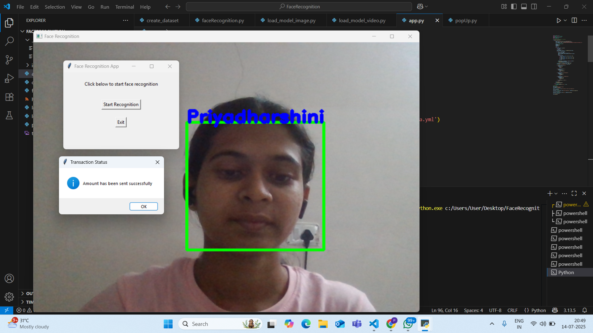

#  Face Recognition System using LBPH Algorithm

A Python-based face recognition project that adds an extra layer of security during online transactions. The system uses OpenCV for facial detection and recognition, along with a Tkinter-based GUI to simulate transaction outcomes.

---

##  Features

- Real-time face detection using webcam
- LBPH (Local Binary Pattern Histogram) face recognizer
- Custom image dataset training
- Handles multiple edge cases:
  - No face detected
  - Unknown face detected
  - Multiple faces detected
  - Face recognized successfully
- GUI interaction using Tkinter
- Displays messages for recognition status

---

##  Tools & Libraries Used

- Python 3.x
- OpenCV (`cv2`)
- NumPy
- Tkinter
- Haarcascade classifier

---

## 📂 Folder Structure
FaceRecognition/
│
├── faceRecognition.py # Core face recognition logic
├── load_model_image.py # For recognition using a static image
├── load_model_video.py # For recognition using webcam
├── app.py # Tkinter-based GUI entry point
├── popUp.py # Tkinter message popups
├── haarcascade_frontalface_alt.xml # Haarcascade model file
├── images/
│ └── 0/ # Training images folder (ID = 0)
│ ├── img1.jpg
│ ├── img2.jpg
│ └── ...
├── README.md
└── .gitignore

▶️ How to Run the Project
1. Clone the Repository
git clone https://github.com/priyadharshinii-k/FaceRecognition.git
cd FaceRecognition

2. Install Requirements
Make sure you have Python and pip installed. Then install OpenCV:
pip install opencv-python

3. Prepare Training Images
Go to the images/ folder.

Add a subfolder with the name as your ID (e.g., 0) and place your face images inside it.

4. Train the Model
Run the script to generate trainingData.yml:
python load_model_image.py

5. Start Face Recognition (Real-Time)
python load_model_video.py
Or you can use the GUI version:
python app.py

## Project Demo

